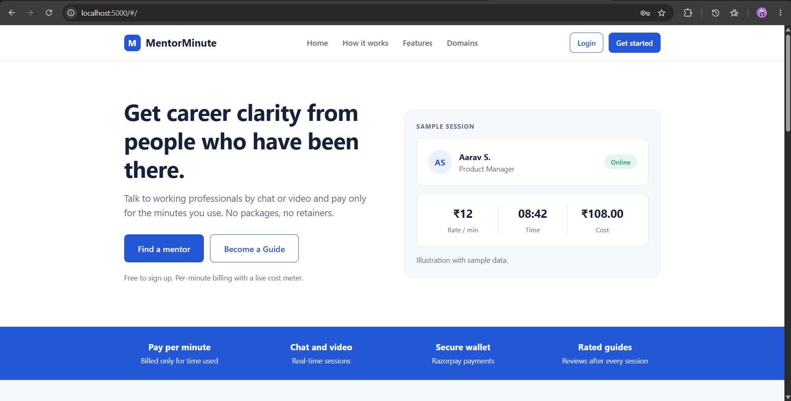
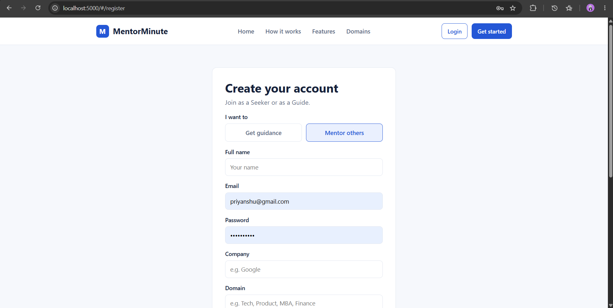
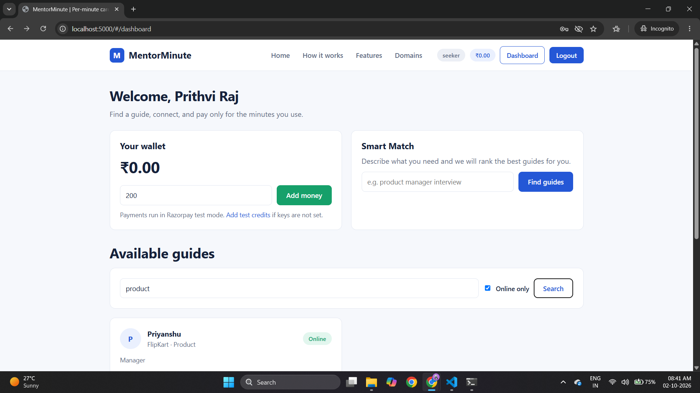
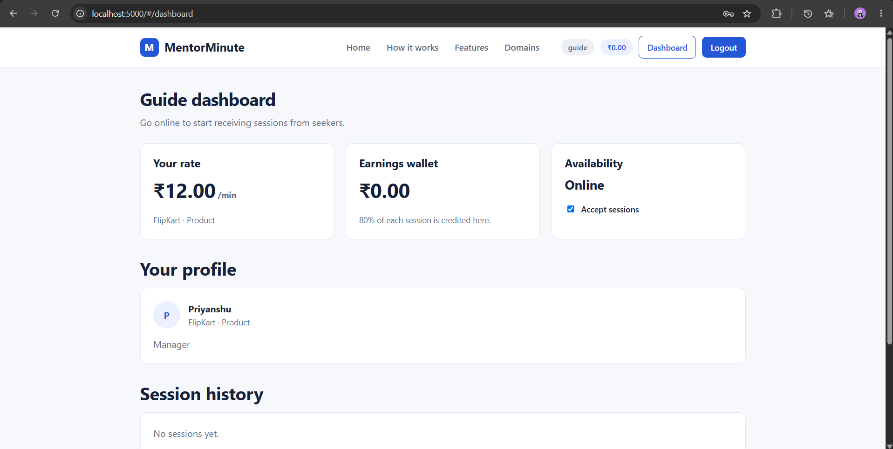
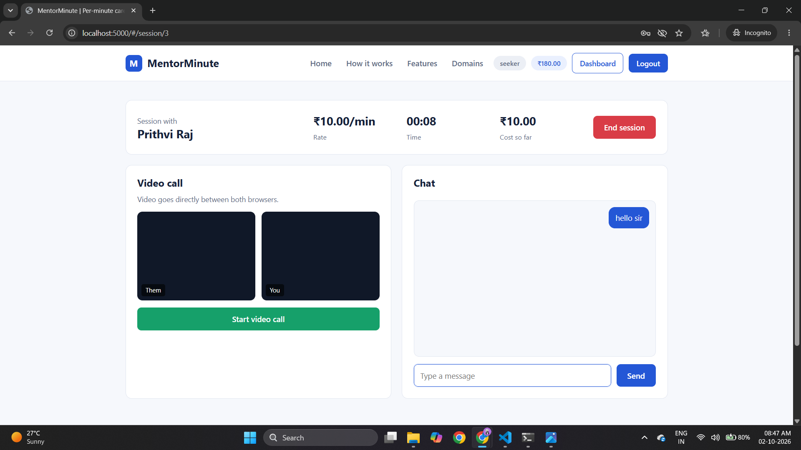
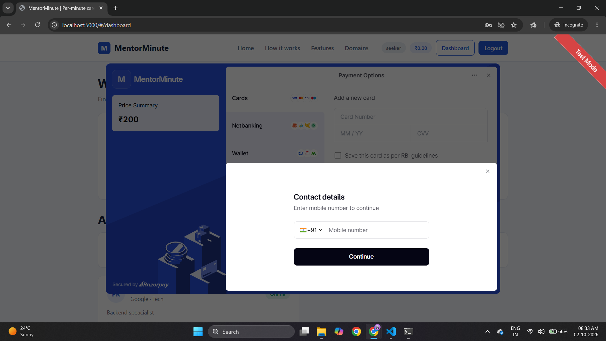

# MentorMinute

A per-minute career mentorship platform where **Seekers** talk to working
professionals (**Guides**) by chat or video and pay only for the minutes
they use. Inspired by the Amigzo model. Built as a B.Tech 3rd year project.

**Live demo:** https://mentor-minute.onrender.com

## Features
- Home page, separate Login/Register pages, and role-based dashboards
- Seeker / Guide registration with JWT login and bcrypt password hashing
- Guide profiles with company, domain, bio, rate and online status
- Guide search by domain plus keyword-based Smart Match
- Real-time chat using Socket.io
- Live billing timer broadcast from the server every second
- Video/voice calls using WebRTC (Socket.io is used for signaling)
- Per-minute billing; a session auto-ends when the wallet runs out
- Wallet top-up through Razorpay (test mode) with server-side signature verification
- Transaction history, ratings and reviews
- 20% platform commission and 80% to the guide, settled in one database transaction

## Tech Stack
| Layer | Technology |
|---|---|
| Frontend | HTML, CSS, JavaScript (no framework) |
| Backend / API | Node.js, Express.js |
| Real-time | Socket.io |
| Video / Voice | WebRTC (STUN) |
| Database | SQLite (better-sqlite3) |
| Authentication | JWT (jsonwebtoken), bcryptjs |
| Payments | Razorpay (test mode) |
| Hosting | Render |

## Project Structure
```
Mentor-Minute/
├── backend/
│   ├── server.js        # Express API, Socket.io, billing logic
│   ├── db.js            # SQLite schema
│   └── package.json
├── frontend/
│   ├── index.html       # App shell
│   ├── css/style.css    # Styles
│   └── js/app.js        # Pages, routing, chat, WebRTC
├── docs/                # Screenshots
├── .gitignore
└── README.md
```

## Getting Started
1. Install Node.js (LTS, version 18 or newer) from nodejs.org
2. Clone the repository
```
   git clone https://github.com/NoTheRaj/Mentor-Minute.git
   cd Mentor-Minute/backend
```
3. Install dependencies
```
   npm install
```
4. (Optional, for Razorpay payments) set your test keys in the same terminal
```
   set RAZORPAY_KEY_ID=rzp_test_xxxxxxxx
   set RAZORPAY_KEY_SECRET=your_secret
```
5. Start the server
```
   npm start
```
6. Open http://localhost:5000

To test the full flow, register a Guide in a normal browser window and a
Seeker in an Incognito window.

## Environment Variables
| Variable | Purpose |
|---|---|
| PORT | Server port (default 5000) |
| JWT_SECRET | Secret used to sign login tokens |
| RAZORPAY_KEY_ID | Razorpay test key id |
| RAZORPAY_KEY_SECRET | Razorpay test key secret |

## API Endpoints
| Method | Endpoint | Description |
|---|---|---|
| POST | /api/auth/register | Register a Seeker or Guide |
| POST | /api/auth/login | Log in and receive a JWT |
| GET | /api/me | Current user and profile |
| GET | /api/guides | List and search guides |
| GET | /api/guides/match?goal= | Smart Match guides by keywords |
| PUT | /api/guides/me/status | Guide goes online or offline |
| POST | /api/wallet/add | Add demo credits (Seeker) |
| GET | /api/wallet | Balance and transactions |
| POST | /api/payments/create-order | Create a Razorpay order |
| POST | /api/payments/verify | Verify payment signature and credit wallet |
| POST | /api/sessions/start | Start a session with a guide |
| GET | /api/sessions/active | Current active session |
| GET | /api/sessions/history | Past sessions |
| GET | /api/sessions/:id | Session details, timer and messages |
| POST | /api/sessions/:id/end | End session and bill |
| POST | /api/reviews | Rate a completed session |

## Socket.io Events
| Event | Direction | Purpose |
|---|---|---|
| join | client to server | Join a session room |
| chat | both | Send and receive chat messages |
| tick | server to client | Live elapsed time and cost |
| signal | both | WebRTC offer, answer and ICE exchange |
| incoming | server to guide | Notify a guide of a new session |
| ended | server to client | Session finished and billed |

## Database Schema
| Table | Purpose |
|---|---|
| users | Accounts, roles and wallet balance |
| guide_profiles | Company, domain, bio, rate and online status |
| sessions | Seeker-guide sessions with time and amount |
| messages | Chat messages per session |
| transactions | Wallet credits and debits |
| reviews | Rating and comment per session |
| payments | Razorpay orders and payment status |

## How Billing Works
Billing is per started minute with a minimum of 1 minute:
`cost = ceil(seconds / 60) x rate`. When a session ends, the seeker is
charged, the guide receives 80% and the platform keeps 20%. The debit and
credit run inside a single database transaction, so both succeed or
neither does. The server checks the wallet every second and ends the
session automatically if the balance cannot cover the next minute.

## Security
- Passwords are hashed with bcrypt
- Protected routes and sockets require a valid JWT
- Razorpay payments are verified with an HMAC signature on the server
- User-generated text is escaped before it is rendered

## Screenshots
| Home | Register |
|---|---|
|  |  |

| Seeker Dashboard | Guide Dashboard |
|---|---|
|  |  |

| Live Session | Razorpay Payment |
|---|---|
|  |  |

## Notes
- Payments run in Razorpay test mode, so no real money is used
- Video calls use a public STUN server; very strict networks may need a TURN server
- Data is stored in a local SQLite file

## Author
Prithvi Raj Makhija, B.Tech CSE (3rd Year), SKIT